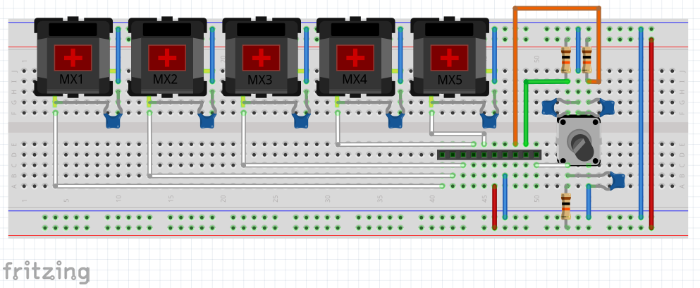
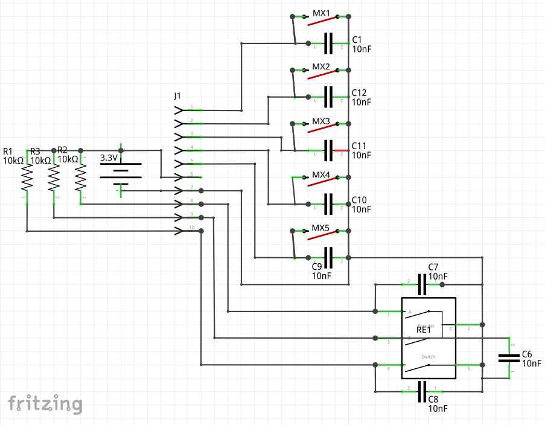
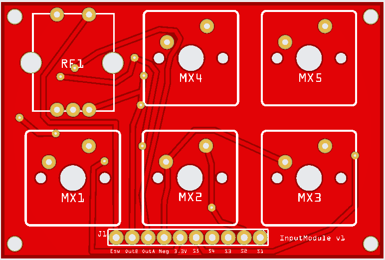
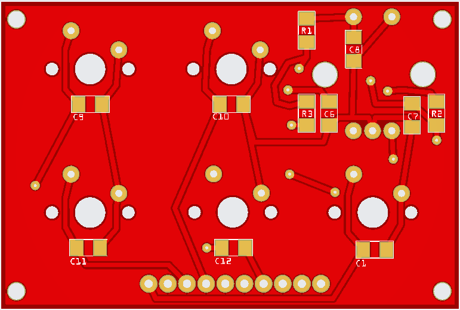
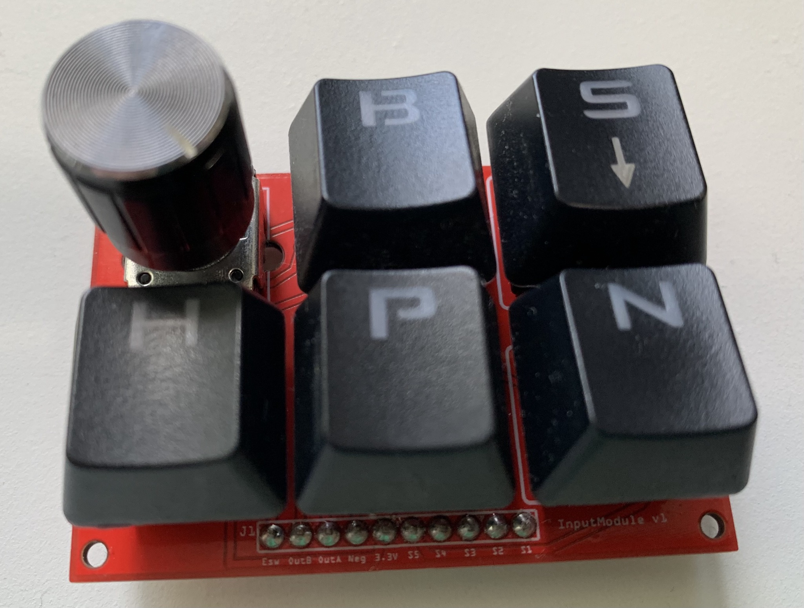

# InputModule

### Generic 5 Button, 1 Rotary Encoder Breadboard Input Controls Module

Designed in [Fritzing](https://fritzing.org) for use with Raspberry Pi and other 3.3V microcontrollers.

* **Fritzing Source:** `InputModule.fzz`
* **Gerber Files:** Included in the attached `.zip` file for direct upload to PCB manufacturers (e.g., JLCPCB).

## Parts
* 3× 10KΩ resistor
* 8× 10nF capacitor
* 1× MIDI DIN connector
* 5× Cherry MX or other mechanical switch.
* 9× Header pins

## Breadboard

## Schematic

## PCB
### Top

### Bottom

## Prototype

## Credit
The circuit was based on this MiniDexed project from Kevin
* https://diyelectromusic.com/2025/09/27/minidexed-raspberry-pi-io-board-v2-build-guide

# Electrical Project Disclaimer & Safety Warning

> **DISCLAIMER:** This project—including all schematics, PCB layouts, Gerber files, firmware, code, and documentation—is provided **"as is" for educational and experimental purposes only**, without warranty of any kind, express or implied, including but not limited to warranties of merchantability, fitness for a particular purpose, or non-infringement.

---

## Safety & Risk Acknowledgment

Electrical and electronic hardware projects carry inherent risks, including but not limited to:
* Short circuits, over-voltage, or incorrect polarity conditions
* Component overheating, thermal failure, or fire hazards
* Damage to connected microcontrollers, host computers, audio gear, or peripheral equipment
* Electrostatic discharge (ESD) or unexpected logic-level behavior

---

## Builder Responsibilities

Before assembling, powering, or connecting any circuit or PCB derived from this repository:

1. **Datasheet Verification:** Double-check all IC pinouts, voltage levels (e.g., 3.3V vs. 5V logic tolerance), power requirements, and trace configurations against official datasheets.
2. **Circuit Testing:** Always test power rails, ground connections, and signal continuity with a multimeter before applying full power or attaching target devices.
3. **Power Delivery:** Use current-limited bench power supplies during initial bring-up, and ensure proper fusing and isolation measures are implemented.
4. **Hardware Offloading:** Isolate development hardware or use optocouplers/buffers when interfacing with sensitive host machines.

---

## Limitation of Liability

By building, modifying, or using this project, **you assume full responsibility for all risks, testing, and outcomes.** 

In no event shall the author(s), contributor(s), or copyright holder(s) be liable for any direct, indirect, incidental, special, exemplary, or consequential damages (including, but not limited to, procurement of substitute goods or services, loss of use, data, or profits, or business interruption) however caused and on any theory of liability, whether in contract, strict liability, or tort (including negligence or otherwise) arising in any way out of the use of this design, even if advised of the possibility of such damage.
